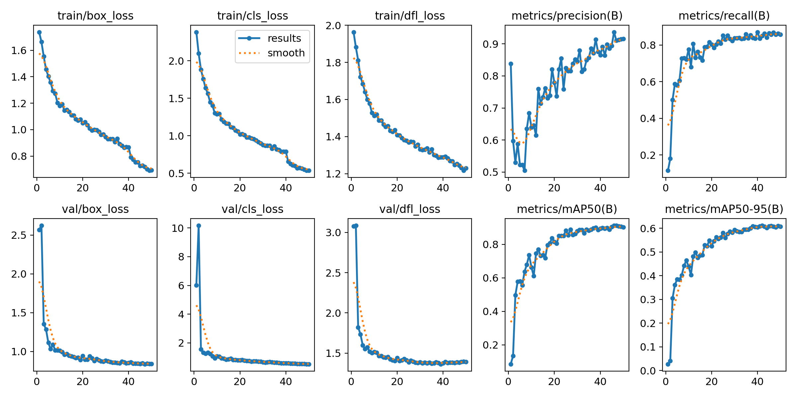
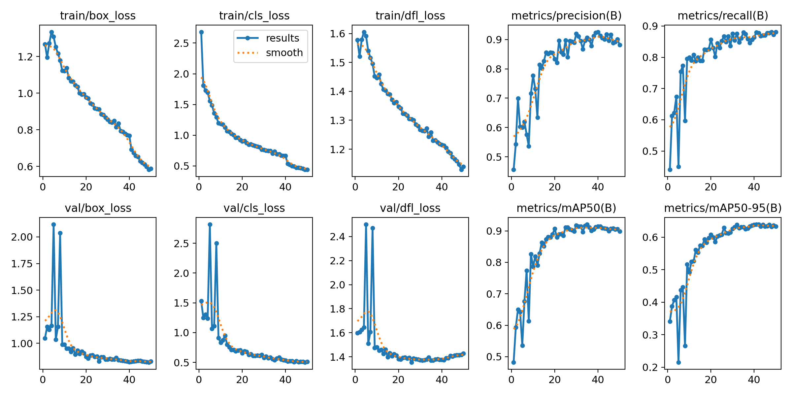
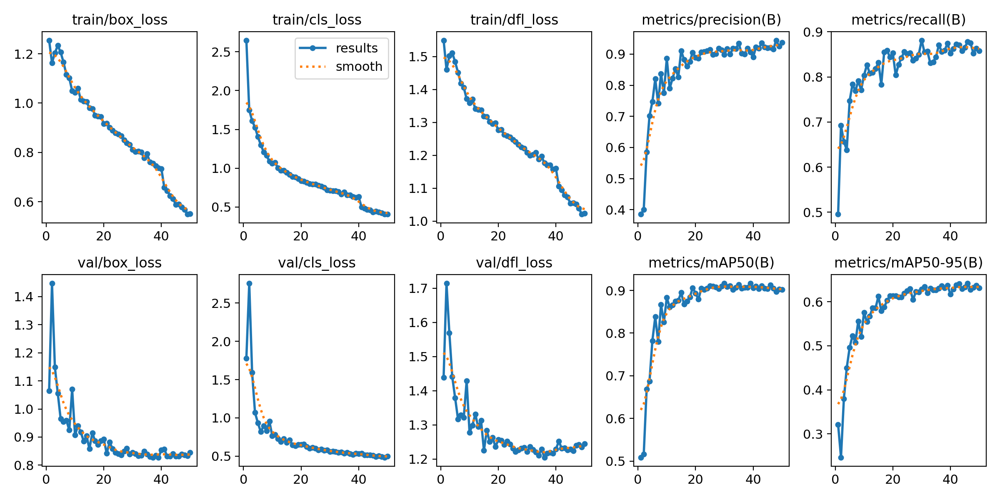

# bee_object_detection_model
This project uses Yolov8 Nano to train an object detection model to identify and classify Varroa mites, worker bees, drone bees, and queen bees from images. 

Dataset: 
```python
from roboflow import Roboflow

rf = Roboflow(api_key="Aq******************")
project = rf.workspace("tainuis-workspace").project("bee-project-upcez")
version = project.version(1)
dataset = version.download("yolov8")
```

## Optimizer Comparison Results

Below is the side-by-side training performance metrics for **AdamW**, **RMSProp**, and **SGD** across 50 epochs. 

## Model Performance & Optimizer Comparison

<table border="0" width="100%">
<!-- Row 1: Training Curves Images -->
<tr>
<td align="center" valign="top" width="33%">
<strong>AdamW Training Curves</strong><br><br>

</td>
<td align="center" valign="top" width="33%">
<strong>RMSProp Training Curves</strong><br><br>

</td>
<td align="center" valign="top" width="33%">
<strong>SGD Training Curves</strong><br><br>

</td>
</tr>

<!-- Row 2: Numerical Metric Tables -->
<tr>
<td valign="top">


| Metric | Value |
| :--- | :---: |
| Precision | 0.8588 |
| Recall | 0.8513 |
| mAP@50 | 0.8948 |
| mAP@50-95 | 0.6118 |

</td>
<td valign="top">


| Metric | Value |
| :--- | :---: |
| Precision | 0.9138 |
| Recall | 0.8795 |
| mAP@50 | 0.9140 |
| mAP@50-95 | 0.6388 |

</td>
<td valign="top">


| Metric | Value |
| :--- | :---: |
| Precision | 0.9211 |
| Recall | 0.8782 |
| mAP@50 | 0.9135 |
| mAP@50-95 | 0.6429 |

</td>
</tr>
</table>


</th>
</tr>
</table>

